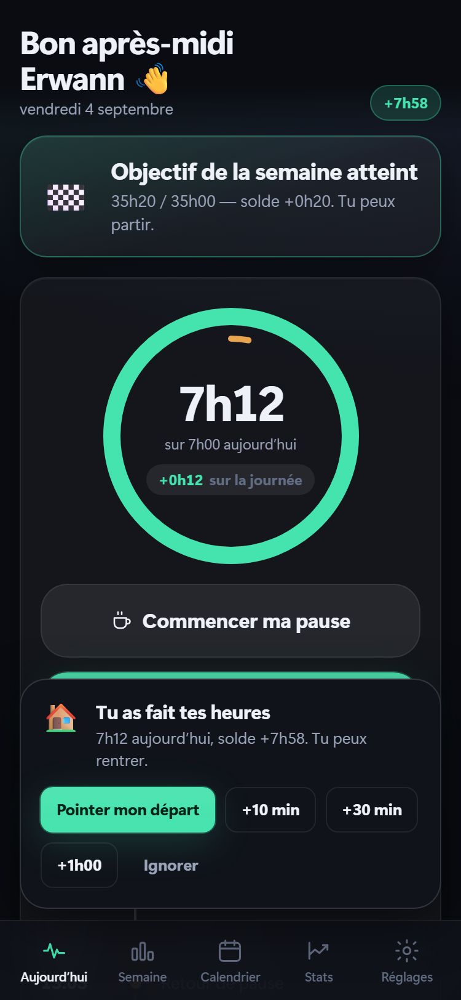
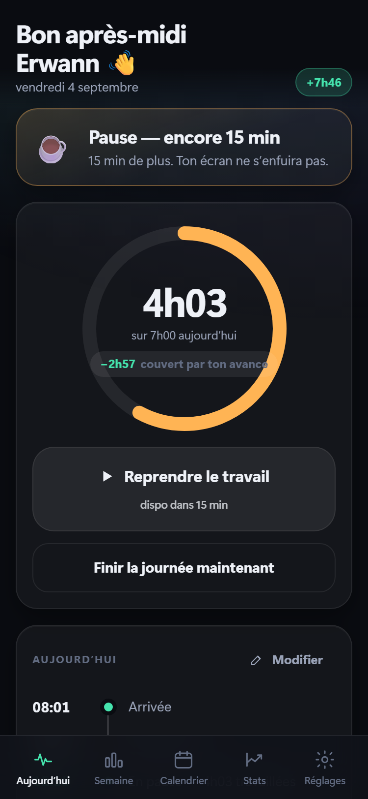
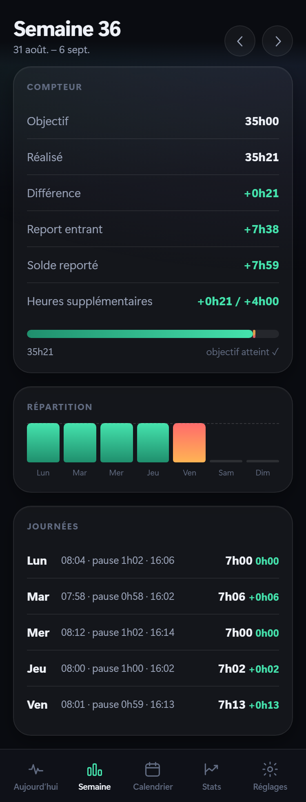
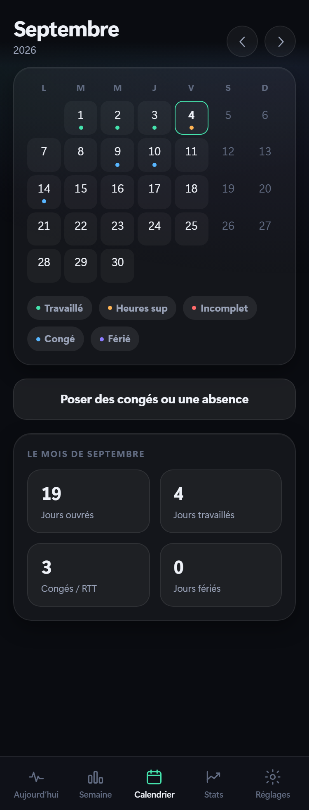
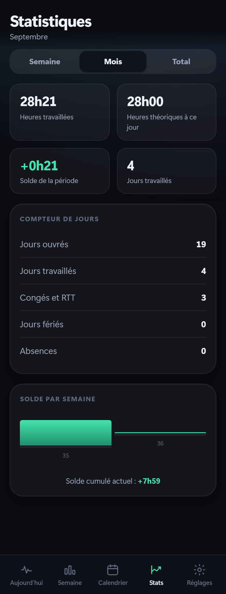
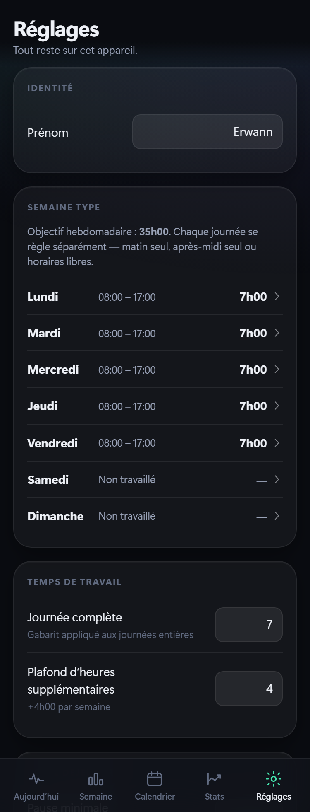
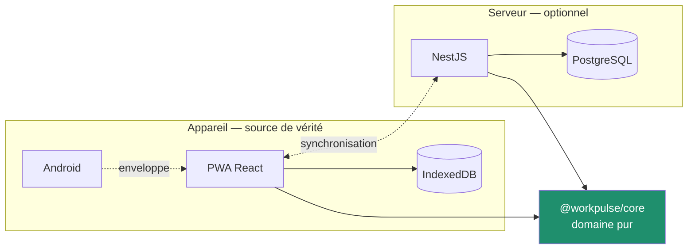

<div align="center">

# WorkPulse

**Assistant personnel de temps de travail.**
Il répond à « puis-je rentrer ? » avant que la question ne se pose.

[](https://github.com/ErwannL/workpulse/actions/workflows/ci.yml)
[](https://github.com/ErwannL/workpulse/actions/workflows/robustesse.yml)
[](https://github.com/ErwannL/workpulse/actions/workflows/android.yml)
[](https://github.com/ErwannL/workpulse/actions/workflows/codeql.yml)


[Installer](#installer) · [Documentation](docs/README.md) ·
[Règles métier](docs/regles-metier.md) · [Journal](CHANGELOG.md)

</div>

---

## Ce que c'est

WorkPulse n'est pas une pointeuse. C'est un assistant : **l'utilisateur ne
calcule rien lui-même**.

Un moteur de décision agrège en permanence le temps travaillé, le solde
reporté, le calendrier et l'heure courante, puis en tire un état unique. Tout
ce que l'application dit — un message, une couleur, une notification — en
découle.

> **16h12** — Tu as fait 35h47 cette semaine. Ton objectif est atteint et tu as
> +47 min d'avance. Tu peux partir. 🏠

> **17h00** — Tu es à −38 min cette semaine. Il te reste 38 min pour revenir à
> l'équilibre.

Aucun de ces deux messages n'est codé séparément. Ils tombent du même calcul.

---

## À quoi ça ressemble

<table>
<tr>
<td width="33%"></td>
<td width="33%"></td>
<td width="33%"></td>
</tr>
<tr>
<td align="center"><b>Il décide à ta place</b><br><sub>Il est 16h12, l’avance couvre la journée : rentre.</sub></td>
<td align="center"><b>Il sait dire non</b><br><sub>Quinze minutes de pause ne font pas une pause légale.</sub></td>
<td align="center"><b>Il montre le report</b><br><sub>Le solde d’une semaine passe à la suivante.</sub></td>
</tr>
<tr>
<td></td>
<td></td>
<td></td>
</tr>
<tr>
<td align="center"><b>Calendrier</b><br><sub>Congés, RTT, télétravail, jours fériés français.</sub></td>
<td align="center"><b>Statistiques</b><br><sub>Semaine, mois, total — sans rien calculer.</sub></td>
<td align="center"><b>Semaine type</b><br><sub>Chaque jour a sa forme : complète, demi-journée, repos.</sub></td>
</tr>
</table>

<sub>Ces images sont engendrées par <code>npm run screenshots</code>, horloge figée
au vendredi 4 septembre : elles ne peuvent pas dériver de l’application.</sub>

---

## Ce qu'il sait faire

**Pointer** — arrivée, pause, reprise, départ. Un geste, en bas de l'écran.

**Calculer** — temps réellement travaillé, solde du jour, solde de la semaine,
report d'une semaine sur l'autre, plafond d'heures supplémentaires.

**Décider** — heure de départ conseillée, pause encore due, objectif ajusté par
l'avance ou le retard accumulé.

**Prévenir** — au bon moment, avec le bon message. À 17 h, si l'avance couvre
la journée, l'application invite à rentrer plutôt que de réclamer des heures.

**S'adapter** — chaque jour de la semaine a sa forme : journée complète, matin
seul, après-midi seul, horaires libres ou repos. Un vendredi matin ramène la
semaine à 31 h 30, sans règle particulière ailleurs.

**Refuser** — reprendre après quinze minutes de pause n'est pas autorisé.
L'application propose autre chose :

> **Pas si vite 🍿** — Tu as encore droit à 15 min de Netflix.

**Se corriger** — tout pointage s'ajoute ou se modifie ; l'heure d'origine est
conservée.

**Se taire** — congés, RTT, maladie, jours fériés français : le temps théorique
tombe à zéro. Une absence déclarée n'est jamais confondue avec un oubli.

---

## Installer

### Android — pour les rappels application fermée

Télécharger `workpulse-<version>.apk` (1,1 Mo) depuis la
[dernière version](https://github.com/ErwannL/workpulse/releases/latest) et
l'ouvrir depuis le téléphone.

C'est la seule enveloppe où les rappels partent **application fermée**.

Si le téléchargement se fige à 100 %, c'est le gestionnaire d'Android qui attend
une connexion déjà coupée : [trois façons d'en sortir](docs/android.md#si-le-téléchargement-se-bloque-à-100-).

### Navigateur — **https://erwannl.github.io/workpulse/**

Ouvrir l'adresse, puis « Ajouter à l'écran d'accueil ». L'application se pose
sur l'écran d'accueil, s'ouvre en plein écran et fonctionne hors ligne. Rien à
télécharger, rien à autoriser.

C'est le chemin le plus court, et le seul qui ne dépende pas du gestionnaire de
téléchargement du téléphone.

### Depuis les sources

```bash
git clone https://github.com/ErwannL/workpulse.git
cd workpulse
npm install
npm run dev
```

---

## Confidentialité

Tout est stocké sur l'appareil, dans IndexedDB. **Aucune donnée ne part sans une
action explicite** — activer la synchronisation, ou exporter une sauvegarde.

L'API de synchronisation existe pour qui utilise plusieurs appareils. Elle est
facultative : sans elle, l'application est complète.

[ADR 0001 — l'appareil est la source de vérité](docs/adr/0001-local-first.md)

---

## Architecture



Le domaine ne dépend de rien — ni React, ni base, ni serveur. Une règle ESLint
l'impose. C'est ce qui rend **impossible** qu'un solde diffère entre le
téléphone et l'API : les deux importent le même code.

| Paquet | Rôle |
| --- | --- |
| `@workpulse/core` | règles, moteur de décision, alertes |
| `@workpulse/web` | interface, stockage local, enveloppe Android |
| `@workpulse/api` | synchronisation multi-appareils |

**Stack** — React 19, TypeScript, Vite, Dexie, Capacitor, NestJS, Prisma,
PostgreSQL, Vitest. Aucune bibliothèque d'interface :
[pourquoi](docs/adr/0007-pas-de-framework-ui.md).

---

## Qualité

| | |
| --- | --- |
| Tests | 392 — 162 domaine, 90 API, 132 application, 8 charge |
| Couverture domaine et API | **100 %** lignes, branches, fonctions |
| Couverture application | 98 % lignes |
| Tests d'intrusion | 23 attaques rejouées contre une vraie base |
| Tenue en charge | moteur sur 5 ans d'historique, API sur 1 an |
| Poids | 116 ko compressés, budget imposé à 220 ko |

La chaîne vérifie format, analyse statique, types, tests avec seuils, tests de
bout en bout sur PostgreSQL, budget de poids, CodeQL et licences des
dépendances. Elle compile le `.apk` à chaque poussée.

Atteindre 100 % a fait supprimer trois morceaux de code inatteignables et
découvrir deux défauts réels. Le banc de charge en a trouvé un troisième : un
départ oublié continuait de courir, et un oubli du lundi valait cinquante
heures le mercredi.

[Stratégie de test](docs/tests.md) · [Sécurité](docs/securite.md) ·
[Intégration continue](docs/ci-cd.md) · [Audit complet](docs/audit-2026-09-05.md)

---

## Documentation

| | |
| --- | --- |
| [Règles métier](docs/regles-metier.md) | comment un solde est calculé, et pourquoi |
| [Moteur de décision](docs/moteur-de-decision.md) | comment l'application décide seule |
| [Architecture](docs/architecture.md) | ce qui vit où, et ce qui dépend de quoi |
| [Base de données](docs/base-de-donnees.md) | les deux schémas, et pourquoi ils diffèrent |
| [API](docs/api.md) | le protocole de synchronisation |
| [Design system](docs/design-system.md) | pourquoi l'interface ressemble à ça |
| [Android](docs/android.md) | ce que l'`.apk` apporte vraiment |
| [Exploitation](docs/exploitation.md) | lancer, déployer, sauvegarder |
| [Contribuer](docs/contribuer.md) | conventions du dépôt |
| [Décisions](docs/adr/) | sept ADR, avec leur contexte |
| [Mémoire du projet](docs/memoire/README.md) | vault Obsidian : le pourquoi, en notes courtes |

---

## Licence

MIT — voir [LICENSE](LICENSE).
