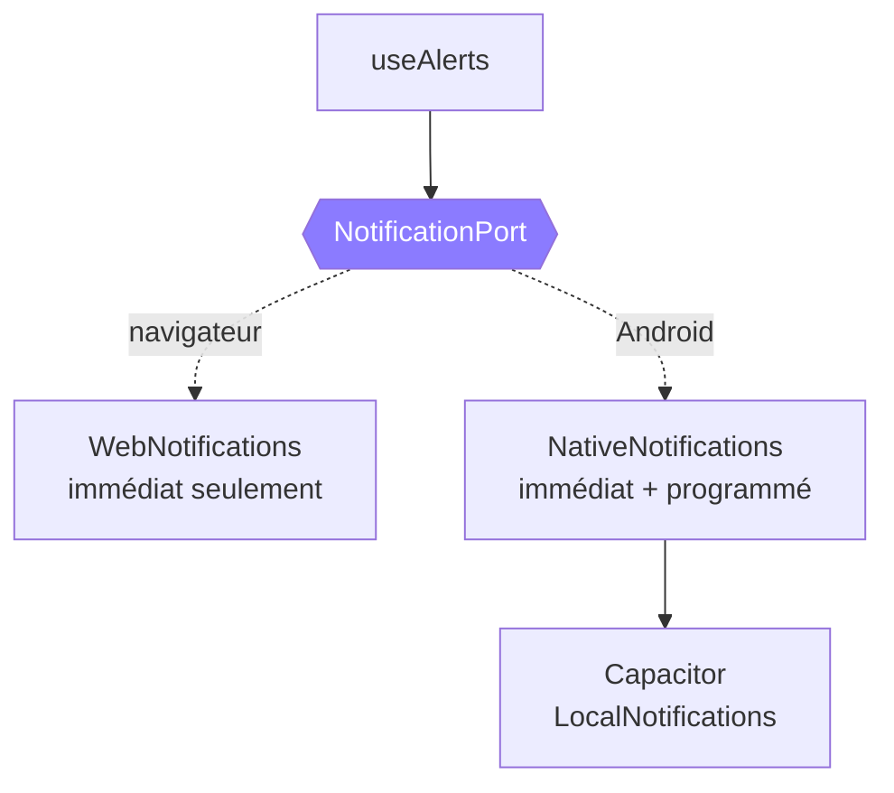

# Application Android

## Ce que l'`.apk` apporte

Ce n'est pas un second produit : c'est exactement la même application, empaquetée
avec [Capacitor](https://capacitorjs.com/). Le code est identique.

Le gain est ailleurs :

| | Navigateur (PWA) | Application installée |
| --- | --- | --- |
| Fonctionne hors ligne | oui | oui |
| Icône sur l'écran d'accueil | oui | oui |
| Notification immédiate | si l'onglet vit | oui |
| **Rappel programmé, application fermée** | **non** | **oui** |
| Installation | menu du navigateur | fichier `.apk` |

Un service worker ne garantit pas le réveil d'un onglet fermé. L'application
installée programme de vrais rappels système : l'alerte de 8 h part même si
WorkPulse n'a pas été ouvert depuis la veille.

---

## Installer

1. Ouvrir la [dernière release](https://github.com/ErwannL/workpulse/releases/latest)
   depuis le téléphone.
2. Télécharger `workpulse-<version>.apk` — environ 1,1 Mo.
3. Ouvrir le fichier téléchargé.
4. Android demandera d'autoriser l'installation depuis cette source. C'est
   normal pour une application distribuée hors magasin.

À la première ouverture, accepter les notifications dans Réglages → Notifications
si l'on veut les rappels programmés.

> **Le chemin le plus court ne passe pas par ce fichier.** L'application est en
> ligne à l'adresse **https://erwannl.github.io/workpulse/** : « Ajouter à
> l'écran d'accueil » l'installe sans rien télécharger. L'`.apk` n'apporte que
> les rappels lorsque l'application est fermée.

### Si le téléchargement se bloque à 100 %

Le gestionnaire de téléchargement d'Android affiche la taille complète puis
tourne indéfiniment, et le fichier n'apparaît jamais.

Ce que le serveur envoie a été vérifié : `200`, `Content-Length` exact, ni
`chunked` ni `gzip`, et l'empreinte du fichier reçu correspond à celle publiée.
Le transfert aboutit. Le blocage est entre la fin du transfert et l'écriture du
fichier.

Deux causes connues, dans cet ordre de vraisemblance :

1. **Le gestionnaire attend la fermeture de la connexion** au lieu de s'arrêter
   à `Content-Length`. GitHub répond `Connection: keep-alive` et
   `Accept-Ranges: bytes` ; un serveur qui répond `close` et `none` ne
   déclenche pas ce comportement.
2. **Play Protect retient le paquet en analyse** sans jamais le rendre. La
   notification reste alors figée à 100 % quelle que soit la source.

Trois issues, de la plus simple à la plus sûre :

1. **Recommencer depuis un autre navigateur** — Firefox, Samsung Internet. Ils
   n'utilisent pas tous le gestionnaire de téléchargement du système.
2. **Servir le fichier depuis un autre poste du réseau local**, avec les
   en-têtes qui ne déclenchent pas le premier cas :

   ```bash
   npm run servir:apk -- workpulse-<version>.apk
   ```

   Puis ouvrir `http://<adresse-du-poste>:8765` depuis le téléphone. Si le
   téléchargement aboutit ainsi, la cause est la première ; s'il se fige
   encore, c'est la seconde et aucun serveur n'y peut rien.
3. **Installer par câble**, ce qui ne dépend d'aucun réseau :

   ```bash
   adb install workpulse-<version>.apk
   ```

Pour vérifier qu'un fichier téléchargé est intact, comparer son empreinte à
celle publiée dans les notes de version :

```bash
sha256sum workpulse-<version>.apk
```

> **Le paquet est signé par une clé de débogage** tant qu'aucun trousseau n'est
> configuré. Il s'installe et fonctionne, mais Android le signalera comme
> provenant d'une source inconnue, et **chaque compilation utilise une clé
> différente** : une mise à jour par-dessus une version précédente échouera avec
> `INSTALL_FAILED_UPDATE_INCOMPATIBLE`, et il faudra désinstaller d'abord. Voir
> [publier une version signée](#publier-une-version-signée), qui règle les deux.

---

## Ce qui est engendré, et ce qui est écrit

```
apps/web/
├── capacitor.config.ts     écrit    identité, couleur de fond, greffons
├── android/                engendré par `cap add android`, versionné
│   ├── app/build.gradle    aligné automatiquement sur la version du paquet
│   └── app/src/main/res/   icônes engendrées par script
└── src/platform/
    └── notifications.ts    écrit    le seul fichier qui distingue les enveloppes
```

Le dossier `android/` est versionné : c'est un projet Gradle complet, nécessaire
à la compilation. Ses sorties (`build/`, `.gradle/`) sont ignorées.

### Les icônes ne sont pas importées

`scripts/sync-android.mjs` dessine le logo — un tracé de sept points — et produit
les cinq densités Android, l'icône ronde, le calque avant d'une icône adaptative
et l'icône monochrome de la barre d'état.

C'est le **même script que le favicon web** : une seule définition du logo pour
les trois supports. Changer le tracé met tout à jour d'un coup.

Le calque avant est dessiné dans les 72 % centraux, zone que tous les masques
Android préservent.

### La version suit le paquet

```
0.4.0  →  versionName "0.4.0",  versionCode 400
1.4.12 →  versionName "1.4.12", versionCode 10412
```

Le `versionCode` doit croître à chaque publication — Android refuse d'installer
par-dessus une valeur inférieure ou égale. Le panneau d'administration de
l'application affiche donc toujours la version réellement installée.

---

## Compiler

La compilation demande le SDK Android et une JDK 21. Elle se fait normalement
dans la chaîne d'intégration, pas sur un poste.

```bash
# Application web, puis synchronisation du projet natif
npm run android

# Ouvrir dans Android Studio
npm run android:open --workspace @workpulse/web

# Ou en ligne de commande, si le SDK est installé
cd apps/web/android && ./gradlew assembleDebug
```

`.github/workflows/android.yml` fait exactement cela à chaque poussée touchant
`apps/web` ou `packages/core`, et publie le `.apk` en artefact. Une régression
de compilation native est détectée sans attendre une publication.

---

## Les notifications, en pratique

`apps/web/src/platform/notifications.ts` expose un contrat unique. Le reste du
code demande des notifications sans savoir ce qui se passe derrière.



### Deux natures de rappel

**Immédiat** — l'alerte vient du compteur : « tu as fait tes heures », « plafond
dépassé ». Elle dépend de l'état en temps réel et ne peut pas être programmée
d'avance.

**Programmé** — l'alerte vient de l'horaire : début de journée, déjeuner,
reprise, fin de journée. `dailyAlertPlan()` la dérive de la forme du jour, et
l'application la programme pour la journée entière.

Deux règles importantes :

- Reprogrammer **remplace** au lieu d'empiler — les identifiants sont stables.
- Un rappel dont l'heure est déjà passée n'est jamais programmé : il sonnerait
  aussitôt.

Une demi-journée ne reçoit que deux rappels au lieu de quatre : pas de déjeuner,
et une fin à midi.

---

## Publier une version signée

Pour distribuer hors du mode débogage — ou viser le Play Store — il faut un
trousseau de clés.

1. Créer le trousseau :

   ```bash
   keytool -genkey -v -keystore workpulse.keystore \
     -alias workpulse -keyalg RSA -keysize 2048 -validity 10000
   ```

2. L'ajouter aux secrets du dépôt, encodé en base64 :

   | Secret | Contenu |
   | --- | --- |
   | `ANDROID_KEYSTORE_BASE64` | le fichier `.keystore` encodé |
   | `ANDROID_KEYSTORE_PASSWORD` | mot de passe du trousseau |
   | `ANDROID_KEY_ALIAS` | `workpulse` |
   | `ANDROID_KEY_PASSWORD` | mot de passe de la clé |

C'est tout : le reste est déjà en place. `scripts/sync-android.mjs` écrit un
bloc `signingConfigs` qui lit ces valeurs dans l'environnement, et le workflow
les lui passe. Sans le secret `ANDROID_KEYSTORE_BASE64`, la même compilation
retombe sur la clé de débogage — aucune branche à maintenir en double.

**Ne jamais committer le trousseau ni ses mots de passe.** Le perdre signifie ne
plus pouvoir mettre à jour l'application installée : Android refuse une mise à
jour signée par une autre clé.

---

## Limites connues

| Limite | Détail |
| --- | --- |
| Signature de débogage | l'installation demande d'autoriser une source inconnue, et chaque compilation change de clé : la mise à jour par-dessus exige une désinstallation |
| Android seulement | iOS demanderait un Mac et un compte développeur payant |
| Pas sur le Play Store | distribution par la page des releases |
| Rappels et économie de batterie | certains constructeurs retardent les rappels d'applications mises en veille ; l'exclusion de l'optimisation de batterie se règle dans Android |
