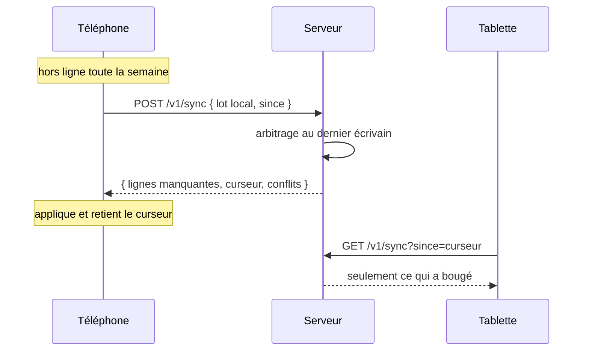

# API de synchronisation

**Facultative.** WorkPulse fonctionne intégralement sans elle. Elle n'existe
que pour tenir plusieurs appareils d'accord.

Documentation interactive : `http://localhost:3000/docs` (OpenAPI en
`/docs/openapi.json`).

---

## Principe

Le serveur n'est pas la source de vérité. Il **arbitre** :



Chaque ligne porte un `updatedAt` produit par le **client**. Le serveur ne
consulte pas sa propre horloge pour trancher : un appareil resté hors ligne
une semaine se resynchronise sans écraser le travail des autres.

---

## Authentification

Un jeton d'appareil, en en-tête :

```http
Authorization: Bearer <jeton>
```

- 32 octets aléatoires, présentés une seule fois lors de l'appariement.
- Stockés hachés en SHA-256 : la base ne contient jamais le jeton.
- Un appareil révoqué (`revokedAt`) est refusé immédiatement.
- Le jeton **n'est jamais accepté en paramètre d'URL** : il finirait dans les
  journaux du serveur et des proxys.

Un jeton inconnu et un jeton révoqué donnent la même réponse : `401`, sans
détail.

---

## Points d'entrée

### `GET /health`

Sonde de vie. Sans authentification.

```json
{ "status": "ok" }
```

### `GET /health/ready`

Sonde de disponibilité : l'application peut-elle servir du trafic ?

```json
{
  "status": "ok",
  "version": "0.4.0",
  "uptimeSeconds": 3412,
  "checks": { "database": "up" }
}
```

Répond `200` même dégradé — c'est le champ `status` qui informe, pas le code
HTTP, pour que la supervision distingue « injoignable » de « joignable mais
sans base ».

---

### `GET /v1/sync`

Ce que le client n'a pas encore vu.

| Paramètre | Type | Rôle |
| --- | --- | --- |
| `since` | entier, epoch ms | ne renvoyer que ce qui a changé après |

```json
{
  "entries": [
    {
      "id": "6f1c1c8e-0000-4000-8000-000000000001",
      "date": "2026-09-07",
      "type": "CLOCK_IN",
      "at": 1788508800000,
      "manual": false,
      "editedAt": null,
      "originalAt": null,
      "updatedAt": 1788508800000,
      "deletedAt": null
    }
  ],
  "days": [
    { "id": "2026-09-11", "status": "LEAVE", "updatedAt": 1788508800000, "deletedAt": null }
  ],
  "settings": { "payload": { "dailyMinutes": 420 }, "updatedAt": 1788508800000 },
  "cursor": 1788508800000,
  "conflicts": 0
}
```

Sans `since`, tout l'historique est renvoyé. `cursor` est à conserver et à
renvoyer tel quel la fois suivante.

---

### `POST /v1/sync`

Envoie un lot local, puis reçoit ce qui manque. **Idempotent** : rejouer le
même lot n'écrit rien et ne crée aucun doublon.

```json
{
  "since": 1788500000000,
  "entries": [ /* … */ ],
  "days": [ /* … */ ],
  "settings": { "payload": { }, "updatedAt": 1788508800000 }
}
```

Réponse : même forme que `GET`, avec `conflicts` = nombre de lignes entrantes
écartées au profit du serveur.

#### Règle d'arbitrage

| Cas | Résultat |
| --- | --- |
| `updatedAt` client > serveur | le client gagne |
| `updatedAt` client < serveur | le serveur gagne, conflit compté |
| Égalité stricte | le serveur gagne, conflit compté |
| Ligne inconnue du serveur | insérée |
| Ligne inconnue du client | conservée et renvoyée |
| Suppression plus récente | propagée |
| Modification plus récente qu'une suppression | la ligne ressuscite |

L'égalité tranche en faveur du serveur pour que le résultat ne dépende pas de
l'ordre d'arrivée des requêtes.

#### Bornes

| Limite | Valeur | Raison |
| --- | --- | --- |
| Taille du corps | 2 Mo | refus avant désérialisation |
| Lignes par lot | 5 000 | un an fait environ 1 000 pointages |
| Longueur d'une note | 2 000 caractères | une note reste une note |
| Clés dans les réglages | 512 | au-delà, ce n'est plus un réglage |
| Profondeur des réglages | 12 niveaux | idem |
| Requêtes par minute | 120 par IP | réglable |

Un champ non déclaré fait échouer la requête en `400` : un client qui invente
une colonne doit échouer bruyamment.

---

### `GET /v1/summary/week`

Solde d'une semaine, **recalculé côté serveur avec le même code que le
téléphone**.

| Paramètre | Type |
| --- | --- |
| `date` | date ISO, n'importe quel jour de la semaine visée |

```json
{
  "week": "2026-W37",
  "monday": "2026-09-07",
  "sunday": "2026-09-13",
  "plannedMinutes": 2100,
  "workedMinutes": 2112,
  "differenceMinutes": 12,
  "carryInMinutes": 0,
  "carryOutMinutes": 12,
  "overtimeMinutes": 12,
  "overtimeCapMinutes": 240,
  "overtimeExceeded": false,
  "days": [
    { "date": "2026-09-07", "status": "WORK", "plannedMinutes": 420, "workedMinutes": 428, "balanceMinutes": 8 }
  ]
}
```

`apps/api/src/summary/summary.service.ts` importe `@workpulse/core` tel quel :
une divergence entre le chiffre du téléphone et celui de l'API est impossible
par construction.

---

## Erreurs

Réponse uniforme :

```json
{
  "statusCode": 400,
  "error": "BAD_REQUEST",
  "message": "date doit être au format AAAA-MM-JJ",
  "path": "/v1/sync",
  "timestamp": "2026-09-05T08:12:44.918Z"
}
```

| Code | Signification |
| --- | --- |
| `400` | entrée invalide, champ inconnu, borne dépassée |
| `401` | jeton absent, inconnu ou révoqué |
| `413` | corps trop volumineux |
| `429` | limite de débit atteinte |
| `500` | erreur interne — message neutre, détail journalisé côté serveur |

Une exception inattendue ne laisse **jamais** fuiter de trace de pile.

---

## Lancer l'API

```bash
docker compose up -d postgres
cp apps/api/.env.example apps/api/.env
npm run prisma:migrate --workspace @workpulse/api
npm run dev:api
```

Ou la pile complète :

```bash
docker compose up --build
```

---

## Ce que l'API ne fait pas

- **Aucune inscription en libre-service.** Les comptes et les appariements se
  créent à la main. Pour un usage personnel, un formulaire d'inscription est
  une surface d'attaque sans contrepartie.
- **Aucun calcul que le client ne sache faire.** `/summary/week` existe pour
  vérifier et pour d'éventuels usages tiers, pas parce que le téléphone en
  aurait besoin.
- **Aucune notification poussée.** Les rappels sont programmés localement par
  l'application installée.
