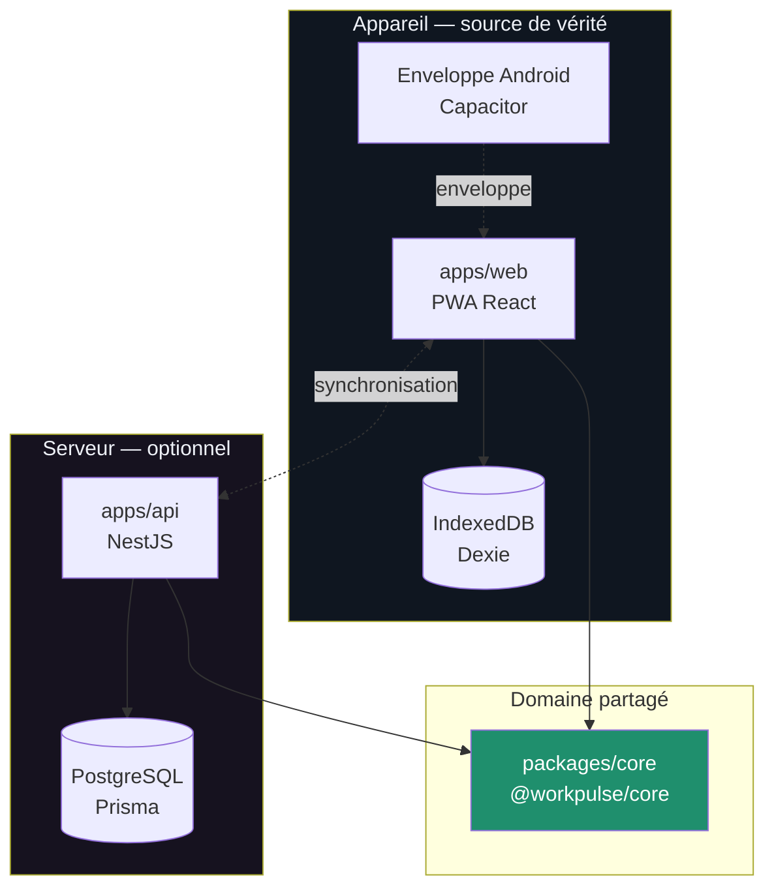
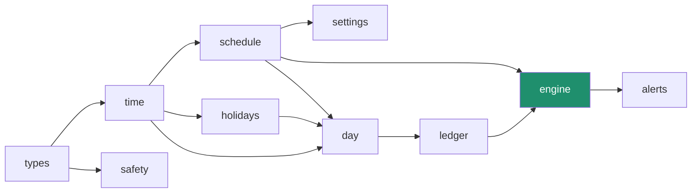
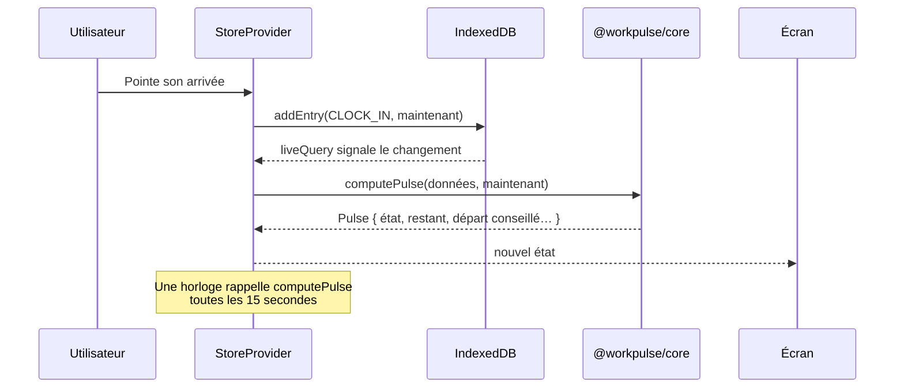
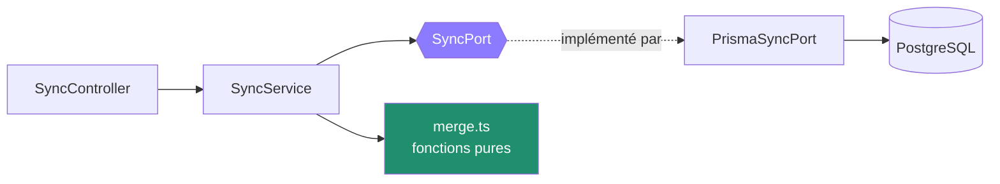

# Architecture

## En une phrase

Un domaine métier pur, sans dépendance, entouré de deux enveloppes qui ne
savent que l'afficher ou le stocker.

## Vue d'ensemble



Le trait en pointillés entre l'application et l'API est **facultatif**.
WorkPulse fonctionne intégralement sans serveur ; la synchronisation n'existe
que pour ceux qui utilisent plusieurs appareils. Voir
[ADR 0001](adr/0001-local-first.md).

## Les trois paquets

| Paquet | Rôle | Dépend de |
| --- | --- | --- |
| `@workpulse/core` | Règles de calcul, moteur de décision, alertes | rien |
| `@workpulse/web` | Interface, stockage local, enveloppe Android | `core`, React, Dexie |
| `@workpulse/api` | Synchronisation multi-appareils | `core`, NestJS, Prisma |

### Pourquoi un domaine séparé

Le calcul d'un solde doit donner le même résultat sur le téléphone et sur le
serveur. Deux implémentations divergeraient — pas tout de suite, mais au
premier cas particulier. Un seul paquet, importé des deux côtés, rend la
divergence impossible par construction.

Ce n'est pas une intention : une règle ESLint l'impose.

```js
// eslint.config.js
{
  files: ['packages/core/**/*.ts'],
  rules: {
    'no-restricted-imports': ['error', {
      patterns: [{ group: ['react', 'react-*', 'dexie*', '@nestjs/*', '@prisma/*', 'node:*'] }],
    }],
  },
}
```

Importer React dans le domaine fait échouer la chaîne d'intégration.

## Le domaine, module par module



| Module | Responsabilité |
| --- | --- |
| `types` | Vocabulaire du domaine, sans logique |
| `time` | Arithmétique de dates, semaines ISO, formats français |
| `holidays` | Jours fériés français, Pâques par computus |
| `schedule` | Forme d'une journée : complète, matin, après-midi, libre, repos |
| `settings` | Réglages, valeurs par défaut, migration des anciennes versions |
| `day` | Automate de pointage → temps travaillé, pauses, présence |
| `ledger` | Objectifs, soldes, report de semaine en semaine, statistiques |
| `breakRules` | Pause déjeuner minimale |
| `engine` | Moteur de décision central |
| `alerts` | Quelle alerte est due, et pourquoi |
| `safety` | Assainissement des données venues de l'extérieur |

Aucune flèche ne remonte : `time` ignore l'existence d'`engine`. Un module ne
connaît que ce dont il a besoin, ce qui permet de le lire seul.

## L'application web

```
apps/web/src/
├── changelog.ts        journal embarqué, dérivé de CHANGELOG.md
├── db/                 IndexedDB : schéma, dépôt, sauvegarde
├── platform/           différences entre navigateur et Android
├── state/              contexte React, horloge, actions de pointage
└── ui/
    ├── components/     briques réutilisables
    ├── screens/        les cinq onglets
    ├── router.ts       routage sur le fragment d'URL
    └── tone.ts         couleur associée à l'état du moteur
```

### Le flux d'une donnée



L'interface ne calcule rien. Elle lit un `Pulse` et l'affiche. C'est ce qui
permet à une règle métier d'être corrigée à un seul endroit.

### Le point de bascule entre les deux enveloppes

`platform/notifications.ts` est le seul fichier qui sache si l'application
tourne dans un navigateur ou dans l'`.apk`. Le reste du code demande des
notifications sans savoir ce qui se passe derrière.

| | Navigateur | Application installée |
| --- | --- | --- |
| Notification immédiate | oui, si l'onglet vit | oui |
| Rappel programmé, application fermée | **non** | **oui** |

C'est la seule différence fonctionnelle entre les deux. Voir
[docs/android.md](android.md).

## L'API

```
apps/api/src/
├── bootstrap.ts        configuration commune (sécurité, validation)
├── config/             lecture et validation de l'environnement
├── prisma/             accès base
├── auth/               jeton d'appareil, garde
├── sync/               protocole de synchronisation
├── summary/            soldes recalculés côté serveur
└── health/             sondes de vie et de disponibilité
```

`sync` s'appuie sur un port (`SyncPort`) plutôt que sur Prisma directement :
la logique de fusion se teste sans base, et l'implémentation de stockage peut
changer sans toucher aux règles.



## Ce que l'architecture rend facile

- **Corriger une règle** : un seul endroit, couvert par des tests, sans toucher
  à l'interface.
- **Ajouter un écran** : il lit le `Pulse`, il n'invente rien.
- **Changer de base** : `SyncPort` d'un côté, `db/repo.ts` de l'autre.
- **Ajouter une plateforme** : l'enveloppe Android n'a demandé aucun changement
  dans le domaine.

## Ce qu'elle rend difficile — volontairement

- **Calculer dans un composant.** Le domaine n'est pas importable à moitié : la
  tentation de « juste faire une soustraction ici » se voit en relecture.
- **Faire diverger client et serveur.** Impossible sans dupliquer le paquet.
- **Introduire une dépendance lourde.** Le budget de poids échoue la chaîne.
