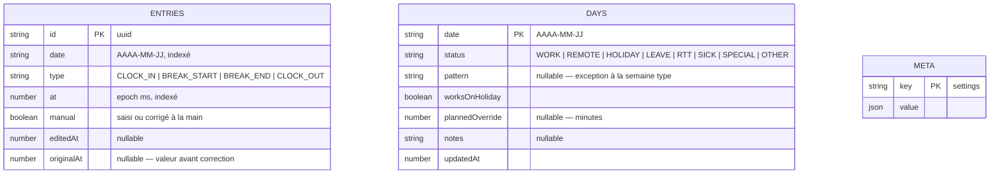

# Base de données

WorkPulse a **deux** stockages, qui ne servent pas la même chose.

| | IndexedDB (appareil) | PostgreSQL (serveur) |
| --- | --- | --- |
| Rôle | source de vérité | point de rendez-vous entre appareils |
| Obligatoire | oui | non |
| Contient | les données d'une personne | les données de plusieurs personnes |
| Suppression | définitive | réversible (`deletedAt`) |
| Sans lui | l'application ne marche pas | l'application marche |

Leurs schémas diffèrent volontairement : voir [pourquoi](#pourquoi-deux-schémas-différents).

---

## 1. Stockage local — IndexedDB

Accès par [Dexie](https://dexie.org/). Base `workpulse`, version 1.



### Index

| Table | Clé primaire | Index secondaires | Pourquoi |
| --- | --- | --- | --- |
| `entries` | `id` | `date`, `type`, `at` | l'écran du jour lit par date |
| `days` | `date` | `status` | le calendrier filtre par statut |
| `meta` | `key` | — | une seule ligne en pratique |

`days` a la **date pour clé primaire** : une journée n'existe qu'une fois. Cela
évite toute question de doublon lors d'une pose de congés sur une plage.

### Ce qui n'est pas stocké

Le temps travaillé, le solde et l'état ne sont **jamais** enregistrés. Ils sont
recalculés depuis les pointages à chaque affichage.

> Stocker un solde, c'est s'exposer à ce qu'il devienne faux après une
> correction rétroactive. Le recalcul coûte moins d'une milliseconde.

### Réglages

Les réglages sont sérialisés dans `meta` sous une seule clé. Leur forme
appartient au domaine (`@workpulse/core`), pas à la base : la base n'a pas à
savoir ce qu'est une semaine type.

`mergeSettings()` migre les réglages écrits par une version antérieure — la
liste `workDays` et les horaires uniques sont convertis en semaine type.

### Sauvegarde

L'export produit un JSON autonome. L'import **valide chaque ligne** avant
d'écrire : un fichier bricolé est refusé plutôt que gobé. Voir
[docs/securite.md](securite.md).

---

## 2. Stockage serveur — PostgreSQL

Accès par [Prisma](https://www.prisma.io/). Schéma dans
`apps/api/prisma/schema.prisma`.

```mermaid
erDiagram
    users ||--o{ devices : "appareils appariés"
    users ||--o{ time_entries : "pointages"
    users ||--o{ work_days : "journées annotées"
    users ||--o| user_settings : "réglages"

    users {
        uuid id PK
        text email UK
        text displayName
        timestamp createdAt
        timestamp updatedAt
    }
    devices {
        uuid id PK
        uuid userId FK
        text name
        text tokenHash UK "SHA-256, jamais le jeton"
        timestamp lastSeenAt
        timestamp revokedAt "nullable"
    }
    time_entries {
        uuid id PK "produit par le client"
        uuid userId FK
        varchar date "AAAA-MM-JJ"
        enum type
        timestamp at
        boolean manual
        timestamp editedAt "nullable"
        timestamp originalAt "nullable"
        timestamp updatedAt "arbitrage des conflits"
        timestamp deletedAt "nullable — suppression réversible"
    }
    work_days {
        uuid id PK
        uuid userId FK
        varchar date
        enum status
        boolean worksOnHoliday
        int plannedOverride "nullable"
        text notes "nullable"
        timestamp updatedAt
        timestamp deletedAt "nullable"
    }
    user_settings {
        uuid userId PK_FK
        json payload
        timestamp updatedAt
    }
```

### Décisions de schéma

**`time_entries.id` est produit par le client.** C'est ce qui rend la
synchronisation idempotente : rejouer le même lot ne crée pas de doublon.
Un identifiant attribué par le serveur obligerait à un aller-retour de
réconciliation.

**`work_days` est unique sur `(userId, date)`.** La date est la clé métier ;
l'`id` technique n'existe que pour Prisma.

**`updatedAt` n'a pas de valeur par défaut.** Il est fourni par le client, car
c'est lui qui arbitre les conflits — l'horloge du serveur n'a pas à décider
qui a écrit en dernier. Voir [ADR 0005](adr/0005-synchronisation-lww.md).

**`deletedAt` plutôt qu'un `DELETE`.** Sans marqueur, une ligne supprimée sur
un appareil réapparaîtrait à la synchronisation suivante depuis un autre
appareil qui l'ignore encore.

**`user_settings.payload` est un `Json` opaque.** Valider sa forme ici
dupliquerait la règle qui vit déjà dans le domaine. Le contenu est en revanche
assaini avant écriture (voir [sécurité](securite.md)).

**`tokenHash` et jamais le jeton.** Une fuite de la base ne donne accès à
aucun compte.

### Index

| Index | Requête servie |
| --- | --- |
| `time_entries (userId, updatedAt)` | lecture incrémentale depuis un curseur |
| `time_entries (userId, date)` | résumé d'une journée ou d'une semaine |
| `work_days (userId, updatedAt)` | lecture incrémentale |
| `work_days (userId, date)` unique | clé métier |
| `devices (userId)` | liste des appareils d'un compte |
| `devices (tokenHash)` unique | authentification à chaque requête |

Le couple `(userId, updatedAt)` est celui qui compte : c'est la requête de
synchronisation, la plus fréquente et la plus volumineuse.

### Suppression en cascade

Supprimer un `user` supprime ses appareils, ses pointages, ses journées et ses
réglages. Le droit à l'effacement est une contrainte du schéma, pas une
procédure à se rappeler.

---

## Pourquoi deux schémas différents

| Aspect | Local | Serveur | Raison |
| --- | --- | --- | --- |
| `deletedAt` | absent | présent | seul un système distribué a besoin de propager une suppression |
| `updatedAt` | sur les journées seulement | partout | l'arbitrage n'existe qu'entre appareils |
| Cloisonnement | inutile | `userId` partout | une seule personne par appareil |
| Identifiants | libres | UUID imposés | ils traversent le réseau |

Aligner les deux schémas ajouterait au stockage local une complexité qui ne
sert qu'au serveur — et qui coûterait à la personne qui n'utilise jamais la
synchronisation, c'est-à-dire le cas nominal.

---

## Migrations

```bash
# Créer une migration après avoir modifié le schéma
npm run prisma:dev --workspace @workpulse/api

# Appliquer les migrations en place
npm run prisma:migrate --workspace @workpulse/api
```

Les migrations sont versionnées dans `apps/api/prisma/migrations/` et
appliquées par la chaîne d'intégration avant les tests de bout en bout : une
migration qui casse est détectée avant d'atteindre `main`.

Côté IndexedDB, Dexie gère les versions de schéma. Toute évolution ajoute une
`version(n).stores({...})` sans supprimer la précédente — une base installée
doit pouvoir se mettre à niveau.
