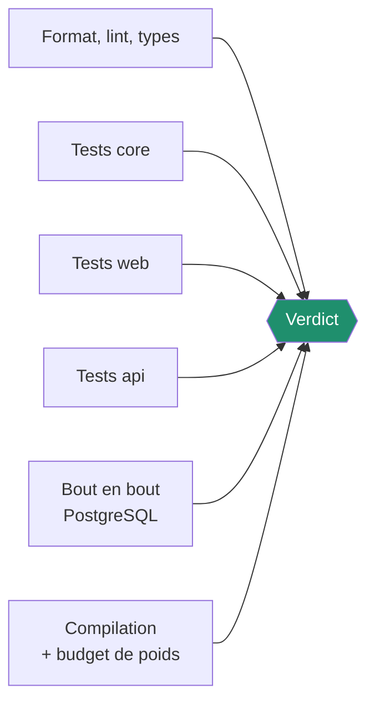
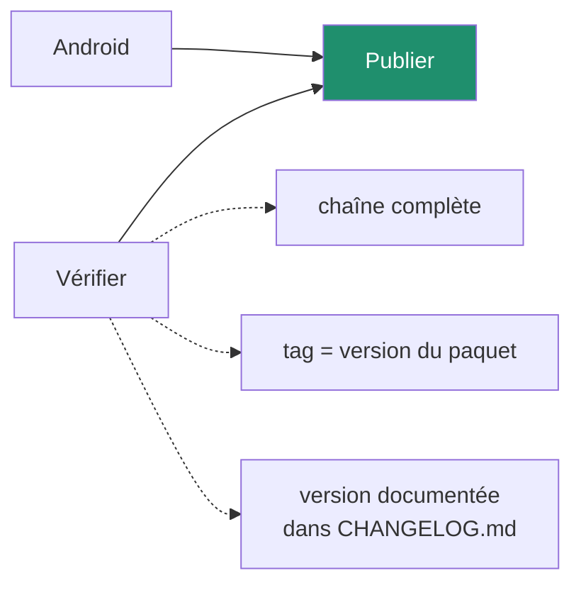

# Intégration et livraison continues

## Ce qui tourne, et quand

| Chaîne | Déclencheur | Durée typique |
| --- | --- | --- |
| [CI](#ci) | poussée, pull request | ~4 min |
| [Robustesse](#robustesse) | poussée, pull request, lundi matin | ~6 min |
| [Android](#android) | poussée touchant `apps/web` ou `packages/core` | ~5 min |
| [CodeQL](#analyse-de-sécurité) | poussée, pull request, lundi | ~3 min |
| [Revue des dépendances](#revue-des-dépendances) | pull request | ~30 s |
| [Convention de commit](#convention-de-commit) | pull request | ~40 s |
| [Pages](#déploiement) | tag `v*` | ~2 min |
| [Release](#publication) | tag `v*` | ~8 min |

---

## CI

`.github/workflows/ci.yml`



Les cinq premières s'exécutent en parallèle. La tâche `verdict` échoue si l'une
d'elles a échoué — ce qui donne un seul contrôle à exiger sur la branche.

### Qualité

Formatage, analyse statique et vérification des types sur les trois paquets. Le
client Prisma est engendré et le domaine compilé au préalable : l'API se
type-vérifie contre les définitions réellement produites.

### Tests

Une matrice de trois tâches, une par paquet. Chacune publie son rapport de
couverture en artefact et un résumé lisible dans l'onglet de la chaîne :

| Mesure | Taux | Couvert |
| --- | ---: | ---: |
| Lignes | 100% | 812/812 |

Les seuils sont dans les fichiers de configuration, pas dans la chaîne : la
même commande échoue en local et à distance.

### Bout en bout

Un service PostgreSQL 17, les migrations appliquées, puis les tests contre une
vraie application NestJS. Une migration cassée est détectée avant `main`.

### Compilation et budget de poids

`scripts/check-bundle-budget.mjs` échoue si l'application dépasse :

| Type | Budget compressé | Actuel |
| --- | ---: | ---: |
| JavaScript | 220 ko | ~116 ko |
| CSS | 30 ko | ~5 ko |

Un ajout de dépendance qui ferait franchir le seuil échoue la chaîne, au lieu de
laisser le poids glisser quelques kilo-octets à la fois.

---

## Robustesse

`.github/workflows/robustesse.yml`

Trois tâches indépendantes :

- **Tenue en charge du domaine** — le moteur sur cinq ans d'historique, avec des
  seuils de temps. Attrape une régression algorithmique.
- **Tests d'intrusion** — 23 attaques contre une vraie API et une vraie base.
- **Charge de l'API** — un injecteur autocannon sur un compte d'un an, quatre
  scénarios, seuils sur les erreurs et la latence. Les latences observées sont
  publiées dans le résumé de la chaîne.

L'exécution hebdomadaire attrape les dérives lentes que personne ne remarque
commit par commit.

---

## Android

`.github/workflows/android.yml`

Compile l'application, aligne le projet Android sur la version du paquet,
assemble le `.apk` avec Gradle et le publie en artefact.

Cette chaîne est le **seul** endroit où le `.apk` est compilé : elle dispose du
SDK Android, pas les postes de développement. Une régression de compilation
native est donc détectée à chaque poussée, pas au moment de publier.

Voir [docs/android.md](android.md).

---

## Analyse de sécurité

CodeQL, jeu de requêtes `security-and-quality`, plus une exécution hebdomadaire
qui rattrape les vulnérabilités publiées après coup.

---

## Revue des dépendances

Sur chaque pull request : vulnérabilités connues à partir du niveau *moderate*,
et licences refusées (GPL-3.0, AGPL-3.0, LGPL-3.0) — le projet est sous MIT, une
licence contaminante doit être refusée à l'entrée plutôt que découverte trop
tard.

---

## Convention de commit

`commitlint` sur les commits de la branche **et** sur le titre de la pull
request. Les portées autorisées sont fixées : `core`, `web`, `api`, `docs`,
`ci`, `deps`, `repo`, `alertes`, `ui`, `db`.

Un journal lisible n'est pas une coquetterie : il alimente les notes de version.

---

## Déploiement

Sur tag `v*`, l'application est compilée et publiée sur GitHub Pages. Les
chemins sont relatifs (`base: './'`) pour fonctionner sous un sous-dossier.

L'application est en ligne : **https://erwannl.github.io/workpulse/**

GitHub Pages doit être activé une fois dans les réglages du dépôt
(**Settings → Pages → source « GitHub Actions »**) — c'est fait. Tant que ce
n'est pas le cas sur un fork,
la chaîne ignore le déploiement et l'explique dans son résumé, plutôt que
d'échouer : c'est une décision du propriétaire, pas une régression du code.

---

## Publication

`.github/workflows/release.yml`



Trois garde-fous avant publication :

1. La chaîne complète repasse — format, lint, types, tests, compilation.
2. Le tag doit correspondre à la version du `package.json`.
3. `CHANGELOG.md` doit contenir une section pour cette version, sinon la
   publication échoue. **Une version se documente avant de se publier.**

La release reçoit :

- `workpulse-<version>.apk` — l'application Android ;
- `workpulse-<tag>.zip` — les fichiers statiques à auto-héberger ;
- les notes extraites de `CHANGELOG.md`, complétées par les instructions
  d'installation et le détail des commits depuis la version précédente.

Ces mêmes notes alimentent l'écran « Nouveautés » de l'application : il n'y a
qu'un texte à écrire, et il est écrit au moment du changement.

---

## Reproduire en local

```bash
npm run verify
```

Exécute ce que la chaîne vérifie : cohérence du journal, formatage, analyse
statique, types, tests avec seuils de couverture.

```bash
npm run test:perf                     # tenue en charge du domaine
docker compose up -d postgres         # puis :
npm run test:e2e --workspace @workpulse/api
```

---

## Dépendances

Dependabot, hebdomadaire, groupé par famille — React, NestJS, Prisma,
outillage — pour éviter cinq pull requests là où une suffit. Les actions GitHub
sont mises à jour mensuellement.
