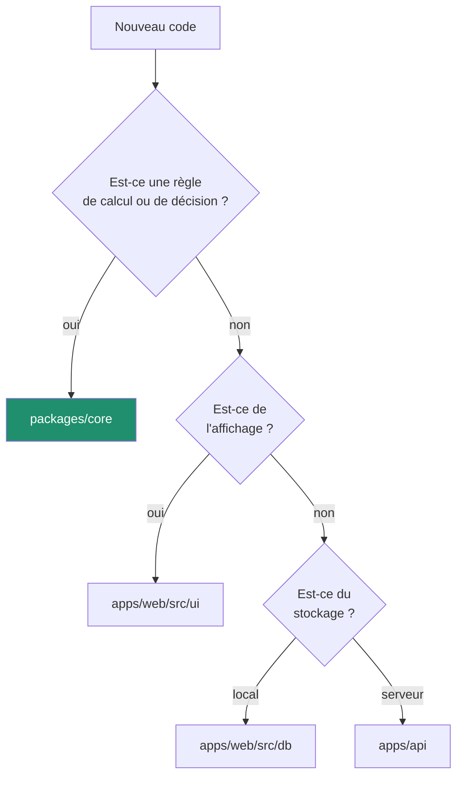

# Contribuer

Projet personnel, mais tenu comme un projet sérieux. Ces conventions valent
aussi pour un agent qui travaille sur le dépôt — voir [CLAUDE.md](../CLAUDE.md).

---

## Avant de commencer

```bash
npm install
npm run verify      # doit passer sur une copie fraîche
```

---

## Où va le code

La question à se poser en premier : **est-ce une règle métier ?**



Si un composant se met à calculer une durée, c'est que la règle manquait au
domaine.

---

## L'ordre de travail

1. **Écrire le test d'abord** pour toute règle métier, tout correctif, toute
   protection. Le voir échouer. Puis écrire le code.
2. **Mettre à jour `CHANGELOG.md`** sous `## [Non publié]`, au moment du
   changement. Pas à la publication.
3. **Mettre à jour la documentation** touchée. Une règle qui change et
   `docs/regles-metier.md` qui ne bouge pas, c'est une divergence installée.
4. **Lancer `npm run verify`** avant de proposer.

---

## Style

### Le code

Le formatage est automatique (`npm run format:fix`). Ce qui suit ne l'est pas :

**Nommer ce que la chose est, pas ce qu'elle fait techniquement.**

```ts
// bien
const advanceBeforeToday = week.carryIn + otherDaysBalance;

// mal
const tmp = a + b;
```

**Commenter le pourquoi, jamais le quoi.**

```ts
// bien
// En cas d'égalité stricte, le serveur l'emporte : deux appareils qui rejouent
// le même lot n'entraînent alors aucune écriture.
return incoming.updatedAt > server.updatedAt ? incoming : server;

// mal
// Compare les updatedAt et renvoie le plus grand
```

Un commentaire qui paraphrase le code vieillit mal. Un commentaire qui explique
une décision reste utile dix ans.

**Les commentaires et l'interface sont en français.** Les identifiants du code
sont en anglais, sauf dans les modules récents où le français s'est imposé — la
cohérence locale d'un fichier prime sur l'uniformité du dépôt.

### Les tests

Un nom de test se lit comme une phrase du cahier des charges :

```ts
it('l’avance de la semaine couvre la journée : il est 14h et on peut rentrer', () => {
```

Voir [docs/tests.md](tests.md).

---

## Commits

Convention [Conventional Commits](https://www.conventionalcommits.org/fr/),
vérifiée par la chaîne.

```
<type>(<portée>): <sujet en une ligne>

<corps : le pourquoi, pas le quoi>
```

| Type | Usage |
| --- | --- |
| `feat` | nouvelle capacité |
| `fix` | correction |
| `refactor` | même comportement, autre forme |
| `docs` | documentation seule |
| `test` | tests seuls |
| `chore` | outillage, dépendances |
| `perf` | performance |

Portées autorisées : `core`, `web`, `api`, `docs`, `ci`, `deps`, `repo`,
`alertes`, `ui`, `db`.

Un bon corps de commit dit ce qui a été appris :

```
fix(core): un départ oublié ne court plus indéfiniment

Un pointage de sortie manquant sur une journée passée continuait de compter
jusqu'à l'instant présent : un oubli du lundi valait cinquante heures le
mercredi. Ces minutes ne sont plus inventées, la journée est signalée comme
incomplète et attend une correction.
```

---

## Branches et versions

`main` reste linéaire et propre. Le travail se fait sur des branches
`feat/…`, `fix/…` ou `refactor/…`, fusionnées puis supprimées.

Chaque version est un tag `vX.Y.Z` :

```bash
# 1. CHANGELOG.md : passer « Non publié » en « [X.Y.Z] — AAAA-MM-JJ »
npm run changelog                 # régénère le journal embarqué
# 2. Aligner les versions des quatre package.json
# 3. Vérifier
npm run verify
# 4. Publier
git commit -am "chore(repo): version X.Y.Z"
git tag -a vX.Y.Z -m "vX.Y.Z — résumé"
git push && git push --tags
```

La chaîne refuse de publier si le tag ne correspond pas à la version du paquet,
ou si `CHANGELOG.md` ne documente pas cette version.

---

## Les invariants à ne pas casser

| Invariant | Pourquoi |
| --- | --- |
| `packages/core` ne dépend de rien | c'est ce qui rend le calcul identique partout ([ADR 0002](adr/0002-domaine-partage.md)) |
| Aucun calcul dans un composant | une règle vit à un seul endroit |
| Aucun solde stocké | il serait faux après une correction rétroactive |
| L'application marche sans réseau | [ADR 0001](adr/0001-local-first.md) |
| Le domaine reste à 100 % de couverture | [ADR 0006](adr/0006-couverture-100.md) |
| Le budget de poids est tenu | c'est une application mobile |

Une règle ESLint fait échouer la chaîne si le premier invariant est violé. Les
autres reposent sur la relecture.

---

## Ouvrir un ticket

Deux modèles, [issues](https://github.com/ErwannL/workpulse/issues/new/choose) :
anomalie ou évolution.

Pour une anomalie, renvoyer si possible à la règle concernée dans
[docs/regles-metier.md](regles-metier.md) — cela évite de discuter d'un
comportement qui est en fait voulu.
