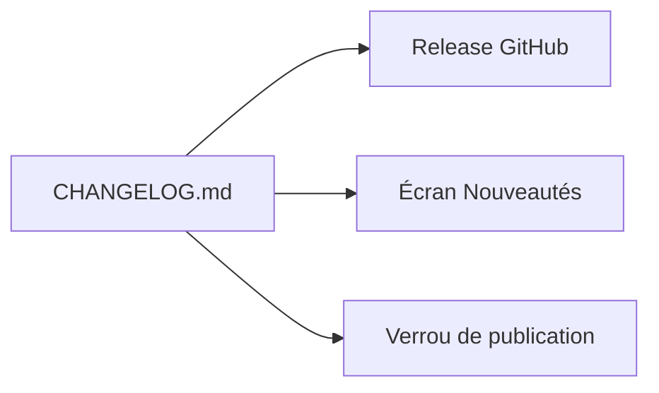

# Journal des versions

`CHANGELOG.md` est la **source unique**. Il alimente trois destinations :

## Les trois

- **La release GitHub** — `scripts/release-notes.mjs` extrait la section de la
  version publiée.
- **L'écran des nouveautés** — `scripts/build-changelog.mjs` en dérive un JSON
  embarqué. À la première ouverture après une mise à jour, l'application résume
  ce qui a changé **depuis la version installée sur cet appareil**, pas depuis
  toujours.
- **Le verrou** — la chaîne refuse de publier un tag dont la version n'est pas
  documentée. Une version se documente avant de se publier.

## Le détail qui compte

Une première installation ne montre **rien**. Personne n'a envie d'ouvrir une
application par la liste de ses correctifs.

## La contrainte

`npm run changelog:check` vérifie que le JSON embarqué est aligné sur le
Markdown. Modifier l'un sans l'autre fait échouer la chaîne.
