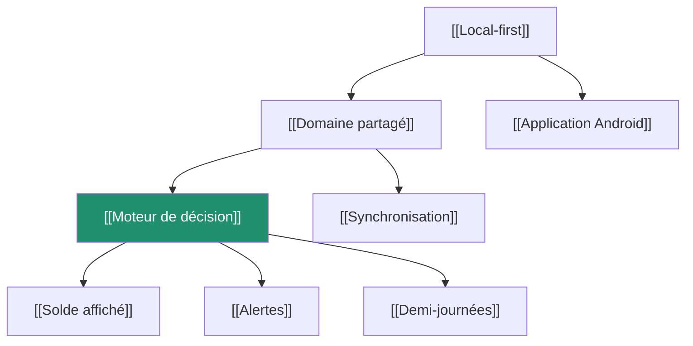

# Mémoire du projet

Un vault [Obsidian](https://obsidian.md/) : ouvrir ce dossier comme un coffre.
Chaque note est courte et répond à **une** question. Les liens `[[…]]` mènent
d'une décision à ses conséquences.

> Ce vault dit **pourquoi**. La [documentation](../README.md) dit **quoi** et
> **comment**. Le [graphe de code](../graphe-de-connaissances.md), engendré par
> graphify, dit **qui appelle qui**.

## Par où entrer

## Les décisions

- [[Local-first]] — l'appareil détient la vérité
- [[Domaine partagé]] — un seul calcul pour le téléphone et le serveur
- [[Moteur de décision]] — un état, et tout en découle
- [[Synchronisation]] — dernier écrivain gagnant
- [[Couverture 100]] — pourquoi ce seuil, et ce qu'il a rapporté
- [[Budget de poids]] — 220 ko, pas un de plus
- [[Pas de framework UI]] — trois feuilles de style

## Les règles qui surprennent

- [[Solde affiché]] — pourquoi il n'affiche pas −6 h le matin
- [[Report de solde]] — comment une semaine ouvre la suivante
- [[Demi-journées]] — matin seul, après-midi seul
- [[Pause déjeuner]] — pourquoi l'application refuse
- [[Départ oublié]] — pourquoi ces heures ne comptent pas

## Ce qui a été appris en route

- [[Pièges rencontrés]] — les six qui ont coûté du temps
- [[Pollution de prototype]] — la vraie faille du projet
- [[Mémoire du report]] — l'optimisation et sa preuve

## L'outillage

- [[Application Android]] — ce que l'`.apk` apporte vraiment
- [[Journal des versions]] — une seule source pour trois destinations
