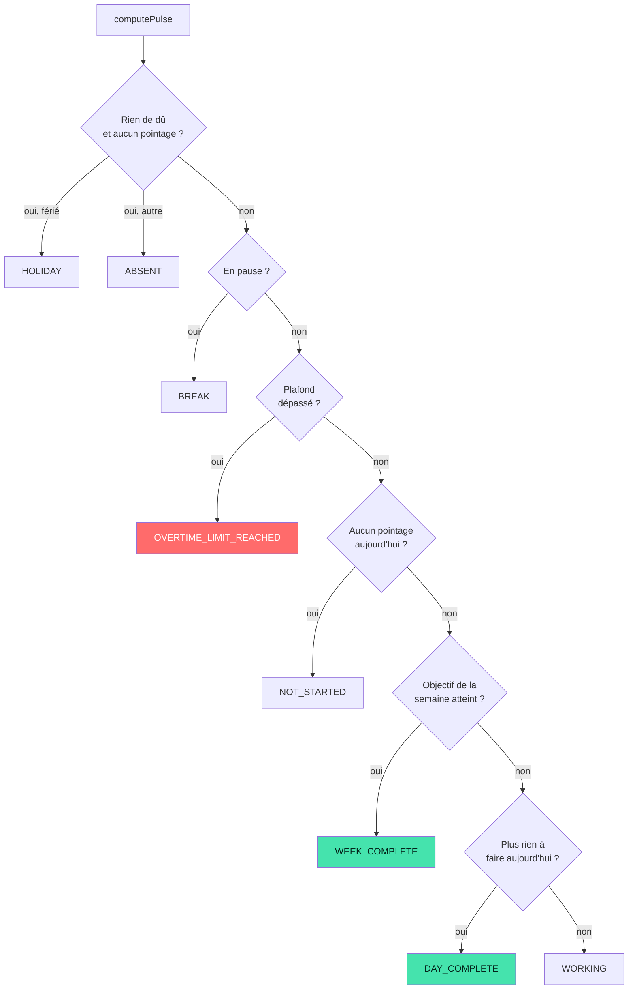

# Le moteur de décision

## L'idée

Plutôt que de coder chaque alerte séparément, une seule fonction agrège tout ce
qu'on sait et produit un état. Le reste — écrans, notifications, couleurs — ne
fait que le lire.

```
temps travaillé aujourd'hui
+ solde reporté des semaines précédentes
+ autres journées de la semaine
+ temps théorique du jour
+ calendrier (fériés, congés, forme de la journée)
+ heure courante
────────────────────────────────────────────
= un état, et tout ce qui en découle
```

Le fameux « il est 14 h, j'ai déjà fait mes heures, rentre chez toi » devient
une **conséquence du calcul**, pas une règle bricolée dans une notification.

`packages/core/src/engine.ts` → `computePulse()`

---

## Ce qu'il produit

```ts
interface Pulse {
  state: PulseState;        // NOT_STARTED | WORKING | BREAK | DAY_COMPLETE | …
  trend: PulseTrend;        // AHEAD | ON_TARGET | BEHIND
  phase: DayPhase;          // ce que disent les pointages
  schedule: DaySchedule;    // la forme du jour

  day: DaySummary;          // objectif, travaillé, solde du jour
  week: WeekSummary;        // objectif, réalisé, report, heures sup

  advanceBeforeToday: Minutes;  // report + autres jours de la semaine
  totalBalance: Minutes;        // le chiffre brut
  standing: Minutes;            // le chiffre affiché
  requiredToday: Minutes;       // objectif ajusté du jour
  remainingToday: Minutes;      // ce qu'il reste à faire
  pendingBreak: Minutes;        // pause encore due

  canLeave: boolean;
  leaveAt: number | null;           // départ conseillé
  leaveAtDayTarget: number | null;  // départ pour boucler le jour seul
  breakVerdict: BreakVerdict | null;

  emoji: string;
  headline: string;
  detail: string;
}
```

Trois champs portent le message — `emoji`, `headline`, `detail`. Les écrans les
affichent sans les composer eux-mêmes : une reformulation se fait à un seul
endroit.

---

## Résolution de l'état



L'ordre compte : un plafond dépassé passe avant tout, parce que c'est la seule
situation où l'application doit contredire l'envie de continuer.

---

## Les décisions de conception qui ont de l'effet

### Le solde affiché ignore ce qu'il reste le temps de faire

À 9 h avec une heure au compteur, le solde brut vaut −6 h. C'est exact et c'est
démoralisant. Le champ `standing` répond plutôt à la question posée : « suis-je
en retard ? » — et à 9 h, non.

```ts
const standing = dayOver ? totalBalance : advanceBeforeToday + Math.max(0, day.balance);
```

Les heures faites **en plus** comptent immédiatement. Le retard, lui, n'existe
qu'une fois la journée finie.

### L'objectif du jour s'ajuste, dans des bornes

```ts
const requiredToday = Math.min(
  day.planned + settings.overtimeCapMinutes,   // jamais une journée démesurée
  Math.max(0, day.planned - advanceBeforeToday) // jamais négatif
);
```

Une avance allège la journée. Un retard l'alourdit — mais pas au-delà du
plafond d'heures supplémentaires. Un retard de vingt heures ne réclame pas une
journée de vingt-sept heures.

### L'heure de départ intègre la pause à venir

```ts
leaveAt = maintenant + restant + pause encore due
```

La pause n'est ajoutée que si la journée en comporte une et dépassera six
heures de travail. Sur une demi-journée, elle ne l'est jamais.

### La couleur suit l'état

`apps/web/src/ui/tone.ts` associe une couleur à chaque état. L'écran ne choisit
pas : il applique. Le bandeau, l'anneau et les pastilles changent donc ensemble,
jamais séparément.

| État | Couleur |
| --- | --- |
| `OVERTIME_LIMIT_REACHED` | corail |
| `BREAK` | ambre |
| `HOLIDAY`, `ABSENT` | violet |
| `DAY_COMPLETE`, `WEEK_COMPLETE` | menthe |
| autres | menthe si on peut partir, bleu sinon |

---

## Les alertes en découlent

`alerts.ts` ne recalcule rien : il lit le `Pulse` et décide s'il y a lieu de
parler.

```ts
export function dueAlert(pulse, settings, memory, now): Alert | null
```

L'horaire de référence du jour ouvre la fenêtre ; l'état du compteur choisit le
message. C'est ce qui produit, à 17 h et sans cas particulier :

- objectif atteint → « 🏠 Fin de journée. Tu peux rentrer. »
- avance suffisante → « 🏠 Ton avance couvre le retard d'aujourd'hui. »
- en retard → « ⏱️ Il te reste 37 min. »

Et à 14 h, si l'objectif est déjà couvert, l'alerte `CAN_LEAVE` part sans
attendre 17 h.

---

## Le battement

L'application rappelle `computePulse` toutes les quinze secondes, et à chaque
retour au premier plan.

```ts
const id = window.setInterval(tick, 15_000);
document.addEventListener('visibilitychange', onVisible);
window.addEventListener('focus', tick);
```

Le calcul doit donc rester bon marché. Le report — qui rejoue toutes les
semaines depuis le début du suivi — est mémoïsé sur l'identité des données :
il ne se recalcule qu'à un vrai changement. Sur cinq ans d'historique, le
premier calcul coûte une quinzaine de millisecondes, les suivants moins d'une.

`ledger.ts` · `performance.perf.ts`

---

## Comment le faire évoluer

**Ajouter un état** : l'ajouter à `PulseState`, le placer dans `resolveState`
selon sa priorité, lui écrire un message dans `narrate`, une couleur dans
`tone.ts`. Trois fichiers, aucun écran.

**Ajouter une alerte** : l'ajouter à `AlertKind`, la placer dans `PRIORITY`,
écrire sa condition dans `build`. L'interface la reçoit sans modification.

**Changer un message** : un seul endroit, `narrate`.

Si une évolution demande de calculer quoi que ce soit dans un composant, c'est
que le moteur devait s'en charger.
