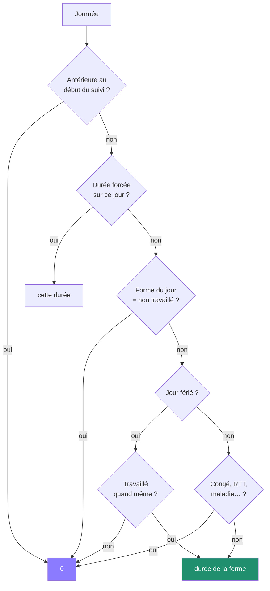

# Règles métier

Ce document fait autorité. Si le code et cette page divergent, l'un des deux
est en tort — et il faut trancher, pas contourner.

Chaque règle porte l'endroit où elle vit et le test qui la vérifie.

---

## 1. La journée

### 1.1 Forme d'une journée

Une journée prend l'une de ces formes :

| Forme | Temps dû | Horaires par défaut | Coupure déjeuner |
| --- | --- | --- | --- |
| Journée complète | durée du gabarit (7 h) | 08:00 – 17:00 | oui |
| Matin seulement | moitié du gabarit (3 h 30) | 08:00 – 12:00 | **non** |
| Après-midi seulement | moitié du gabarit (3 h 30) | 13:00 – 17:00 | **non** |
| Horaires personnalisés | au choix | au choix | au choix |
| Non travaillé | 0 | — | — |

> Une demi-journée n'a pas de coupure : couper une matinée de trois heures et
> demie n'a pas de sens, et la pause minimale ne s'y applique donc pas.

`packages/core/src/schedule.ts` · `schedule.test.ts`

### 1.2 Temps dû et horaires de référence sont deux choses distinctes

Les horaires 08:00 – 17:00 avec une heure de coupure couvrent huit heures.
Le temps dû, lui, vaut sept heures. **Ce n'est pas une incohérence** : les
horaires servent uniquement à savoir quand l'application doit se manifester.
Le solde, lui, ne regarde que la durée due.

L'écran de réglage signale l'écart lorsqu'il résulte d'une saisie manuelle,
et se tait sur un préréglage où il est voulu.

### 1.3 Temps travaillé

Le temps travaillé se déduit des pointages, jamais de l'horloge :

```
ARRIVÉE ──────────── DÉBUT PAUSE      RETOUR ──────────── DÉPART
   └── compté ──────────┘                └───── compté ──────┘
                        └── non compté ──┘
```

Une journée en cours compte jusqu'à l'instant présent.

`packages/core/src/day.ts` · `day.test.ts`

### 1.4 Une journée passée laissée ouverte ne compte pas

Si un départ n'a jamais été pointé et que la journée est révolue, les minutes
correspondantes **ne sont pas comptées**. La journée est signalée comme
incomplète et attend une correction.

> Sans cette règle, un oubli du lundi vaudrait cinquante heures le mercredi.

`day.ts` · test « ne compte pas les heures d'un départ jamais pointé »

### 1.5 Séquences incohérentes

L'automate tolère l'imprévu plutôt que d'échouer :

| Situation | Comportement |
| --- | --- |
| Deux arrivées de suite | la seconde est ignorée, anomalie signalée |
| Arrivée pendant une pause | vaut une reprise |
| Pause sans arrivée | ignorée, anomalie signalée |
| Départ pendant une pause | clôt la pause puis la journée |
| Départ sans arrivée | ignoré, anomalie signalée |

---

## 2. La pause déjeuner

### 2.1 Minimum de trente minutes

Reprendre le travail avant trente minutes de pause est **refusé**. L'application
propose autre chose plutôt que d'expliquer un règlement :

> **Pas si vite 🍿** — Tu as encore droit à 15 min de Netflix.
> **Et si tu allais prendre l'air ?** — 15 min dehors, ça ne se refuse pas.

Six formulations tournent. Le seuil et l'application stricte de la règle sont
réglables ; par défaut, la règle est stricte.

`packages/core/src/breakRules.ts` · `engine.test.ts`

### 2.2 La pause ne s'impose qu'aux journées qui en comportent une

Une demi-journée n'a pas de coupure, donc pas de pause minimale.

---

## 3. Le temps théorique

Le temps dû d'une journée se détermine dans cet ordre :



### 3.1 Rien n'est dû avant le début du suivi

Installer l'application un vendredi ne crée pas quatre jours de dette.

`day.ts` · test « ne réclame rien avant le début du suivi »

### 3.2 Une absence n'est pas un oubli

Congé, RTT, maladie, jour férié, événement exceptionnel : le temps théorique
tombe à zéro. Le solde reste neutre. C'est précisément ce qui distingue une
journée déclarée d'une journée oubliée.

### 3.3 Un jour férié peut être travaillé

L'application connaît les onze jours fériés français, jours mobiles compris
(Pâques par computus de Meeus). Chacun peut être basculé en jour travaillé,
auquel cas les heures comptent normalement.

`packages/core/src/holidays.ts` · `holidays.test.ts`

---

## 4. La semaine

### 4.1 L'objectif est la somme des journées

Une semaine de cinq journées complètes vaut 35 h. Un vendredi matin seul la
ramène à 31 h 30 — sans règle particulière ailleurs.

`schedule.ts` → `weeklyMinutes()`

### 4.2 Solde

```
solde de la semaine = heures travaillées − heures théoriques
```

### 4.3 Report

Le solde d'une semaine ouvre la suivante. Positif comme négatif.

```
Semaine 1 : 38 h faites, 35 h dues        →  +3 h
Semaine 2 : commence avec un report de    →  +3 h
```

Le report se calcule en rejouant toutes les semaines depuis le début du suivi.
Le résultat est mémoïsé sur l'identité des données : il n'est recalculé que
lorsque les données changent, pas à chaque battement d'horloge.

`packages/core/src/ledger.ts` · `ledger.test.ts`

### 4.4 Plafond d'heures supplémentaires

Par défaut **+4 h par semaine**. Au-delà, l'application le signale et cesse de
pousser au travail. Le plafond est réglable.

---

## 5. Le solde affiché

### 5.1 Ce qu'il reste le temps de faire n'est pas du retard

À 9 h avec une heure au compteur, l'application n'affiche pas « −6 h ». Elle
affiche « 0h00 ».

Les heures faites **en plus**, elles, comptent immédiatement. Une fois la
journée pointée, le retard devient réel.

> Le champ s'appelle `standing`. `totalBalance` reste disponible pour qui veut
> le chiffre brut.

`engine.ts` · tests « ne compte pas comme du retard les heures encore
faisables aujourd'hui »

### 5.2 Objectif ajusté du jour

```
objectif du jour = temps dû − avance disponible
```

L'avance disponible additionne le report et les autres journées de la semaine.
Le résultat est borné : jamais négatif, jamais au-delà du temps dû augmenté du
plafond d'heures supplémentaires. Un retard de vingt heures ne réclame pas une
journée de vingt-sept heures.

### 5.3 Heure de départ conseillée

```
départ conseillé = maintenant + temps restant + pause encore due
```

La pause n'est ajoutée que si la journée en comporte une et dépassera six
heures de travail.

---

## 6. Les états du moteur

Un seul état résume la situation, résolu dans cet ordre :

| Ordre | État | Condition |
| --- | --- | --- |
| 1 | `HOLIDAY` | jour férié, rien de dû, aucun pointage |
| 2 | `ABSENT` | congé ou journée non travaillée, aucun pointage |
| 3 | `BREAK` | pause en cours |
| 4 | `OVERTIME_LIMIT_REACHED` | plafond hebdomadaire dépassé |
| 5 | `NOT_STARTED` | aucun pointage aujourd'hui |
| 6 | `WEEK_COMPLETE` | objectif de la semaine atteint |
| 7 | `DAY_COMPLETE` | plus rien à faire aujourd'hui |
| 8 | `WORKING` | tout le reste |

Une tendance accompagne l'état : `AHEAD`, `ON_TARGET` ou `BEHIND`, avec une
tolérance de dix minutes autour de l'objectif.

Voir [le moteur de décision](moteur-de-decision.md).

---

## 7. Les alertes

### 7.1 L'horloge déclenche, le compteur décide

Les horaires de référence du jour ouvrent la fenêtre ; c'est l'état du compteur
qui choisit le message.

| Heure | Situation | Message |
| --- | --- | --- |
| 17:00 | objectif atteint | 🏠 Fin de journée. Tu peux rentrer. |
| 17:00 | avance suffisante | 🏠 Ton avance couvre le retard d'aujourd'hui. |
| 17:00 | en retard | ⏱️ Il te reste 37 min. |
| 14:00 | objectif déjà couvert | 🏠 Tu as fait tes heures. |

### 7.2 Priorité

`OVERTIME` › `CAN_LEAVE` › `DAY_END` › `LUNCH_END` › `LUNCH_START` › `DAY_START`

Le dépassement de plafond passe avant tout et ne se reporte pas.

### 7.3 Réponses

Toute alerte accepte les mêmes réponses : agir, reporter de 10 min, 30 min ou
1 h, ou ignorer pour la journée. La mémoire repart à zéro chaque matin.

### 7.4 Une demi-journée n'a pas d'alerte de déjeuner

Et son alerte de fin tombe à midi, pas à 17 h.

`packages/core/src/alerts.ts` · `alerts.test.ts`

---

## 8. Confidentialité

Tout est stocké sur l'appareil. Aucune donnée ne part sans une action
explicite : activer la synchronisation, ou exporter une sauvegarde.

Voir [ADR 0001](adr/0001-local-first.md).
