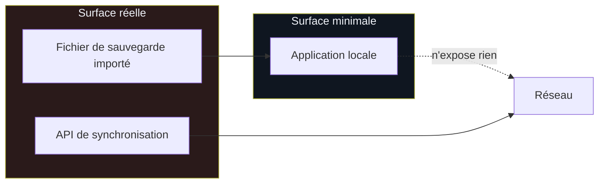

# Sécurité

## Surface d'attaque



Sans synchronisation, WorkPulse n'expose **rien** : pas de serveur, pas de
requête sortante, pas de compte. Deux points restent :

1. **Le fichier de sauvegarde importé** — il vient de l'extérieur.
2. **L'API**, si elle est activée.

---

## Ce qui est en place

| Protection | Où | Vérifiée par |
| --- | --- | --- |
| Assainissement contre la pollution de prototype | `core/safety.ts` | 11 tests unitaires + 2 e2e |
| Validation stricte des entrées | `bootstrap.ts` | e2e « champ inconnu » |
| Bornes de volume | `sync.dto.ts`, `safety.ts` | e2e « abus de volume » |
| Limite de taille du corps | `bootstrap.ts` | 2 Mo avant désérialisation |
| Contrôle de débit | `app.module.ts` | garde globale |
| En-têtes de sécurité | `bootstrap.ts` (helmet) | e2e « fuites » |
| Jetons hachés | `auth.service.ts` | tests unitaires |
| Requêtes paramétrées | Prisma | e2e « injection » |
| Erreurs neutres | `http-exception.filter.ts` | e2e « fuites » |
| Cloisonnement des comptes | `sync.service.ts` | e2e « cloisonnement » |
| Validation des sauvegardes | `db/repo.ts` | 9 tests |
| Analyse statique | CodeQL | chaîne hebdomadaire |
| Vulnérabilités des dépendances | dependency-review | à chaque pull request |

---

## Les attaques rejouées

`apps/api/test/security.e2e.test.ts` — 23 scénarios contre une vraie
application et une vraie base.

### Authentification

| Attaque | Attendu |
| --- | --- |
| Aucun jeton | `401` sur les trois points d'entrée |
| Jeton révoqué | `401` |
| Jeton en paramètre d'URL | `401` — il finirait dans les journaux |
| `Basic` au lieu de `Bearer` | `401` |
| Injection d'en-tête dans `Authorization` | `401` |
| Jeton inconnu | `401` sans indice sur son existence |

### Cloisonnement

Deux comptes réels. Bob ne voit rien d'Alice. Bob qui envoie une ligne portant
l'identifiant d'une ligne d'Alice crée une ligne **chez lui** : le compte est
déduit du jeton, jamais du corps de la requête.

### Injection

```
'; DROP TABLE time_entries; --
' OR '1'='1
1; DELETE FROM users WHERE 't'='t
\'; SELECT pg_sleep(5); --
```

- Dans un champ `date` : rejeté en `400` par la validation de format.
- Dans une **note** : accepté, stocké tel quel, relu tel quel — la table existe
  toujours. Prisma paramètre, il ne concatène pas.
- Opérateur déguisé (`{"gt": ""}`) là où une chaîne est attendue : `400`.
- Statut hors liste (`"ADMIN"`) : `400`.
- Traversée de chemin (`../../etc/passwd`) dans une date : `400`.

### Pollution de prototype

C'est **la** vulnérabilité que ce projet avait réellement.

Les réglages sont le seul champ libre du protocole : leur forme appartient au
domaine, la base ne les valide pas. Un objet contenant `__proto__` fusionné par
un `{...a, ...b}` modifie le prototype d'`Object` — et donc le comportement de
tout le processus.

```json
{ "settings": { "payload": { "__proto__": { "pirate": true } } } }
```

`sanitizeJson()` recopie clé par clé et écarte `__proto__`, `constructor` et
`prototype`, à toute profondeur, tableaux compris. Le test vérifie ensuite que
`({}).pirate` reste `undefined`.

La même fonction protège l'import de sauvegarde côté application : le fichier
y vient aussi de l'extérieur.

### Abus de volume

| Attaque | Défense |
| --- | --- |
| 5 001 pointages en un lot | `400` |
| Note de 5 000 caractères | `400` |
| Réglages à 600 clés | `400` |
| Réglages imbriqués 20 fois | `400` |
| Corps de plus de 2 Mo | `413`, avant désérialisation |
| Champ inconnu | `400`, jamais ignoré |

### Fuites

- Aucune trace de pile, aucun nom de fichier, aucune mention de Prisma dans une
  réponse d'erreur.
- Pas d'en-tête `X-Powered-By`.
- `X-Content-Type-Options: nosniff` et `X-Frame-Options` présents.

---

## Trois défauts trouvés en écrivant ces tests, et un en les exécutant

**Le contrôle de débit ne s'appliquait pas.** `ThrottlerModule.forRoot()`
configure mais n'active rien : sans une garde globale `APP_GUARD`, aucune
limite n'est appliquée. Le module était déclaré depuis le début et donnait
une fausse impression de protection.

**Les protections n'étaient pas testées.** `helmet`, la limite de taille et la
validation stricte vivaient dans `main.ts` ; les tests de bout en bout
construisaient leur propre application et ne les exerçaient donc jamais. La
configuration a été extraite dans `bootstrap.ts`, partagé par les deux.

---

## Décisions assumées

**SHA-256 sur les jetons, pas bcrypt.** Un jeton de 32 octets aléatoires n'est
pas devinable : une dérivation lente ne protégerait de rien et ralentirait
chaque requête. Ce raisonnement ne vaudrait pas pour un mot de passe.

**Pas d'inscription en libre-service.** Les comptes se créent à la main. Pour
un usage personnel, un formulaire public serait une surface d'attaque sans
contrepartie.

**Aucune donnée personnelle dans les journaux.** Les messages ne citent que des
identifiants techniques.

**CORS fermé par défaut.** Sans `CORS_ORIGINS`, aucune origine n'est autorisée.

---

## Ce qui reste ouvert

| Sujet | État | Notes |
| --- | --- | --- |
| Chiffrement au repos, côté appareil | non fait | IndexedDB n'est pas chiffré ; l'appareil l'est généralement |
| Rotation automatique des jetons | non fait | révocation manuelle disponible |
| Audit d'accès | non fait | `lastSeenAt` par appareil seulement |
| Signature de release du `.apk` | non fait | paquet signé par une clé de débogage, voir [android.md](android.md) |
| Authentification à deux facteurs | hors périmètre | usage personnel, jeton d'appareil |

Ces manques sont listés pour être décidés, pas oubliés.

---

## Signaler une faille

Ouvrir une *security advisory* privée sur le dépôt plutôt qu'une issue
publique. Le projet est personnel : il n'y a pas de délai de réponse garanti.
