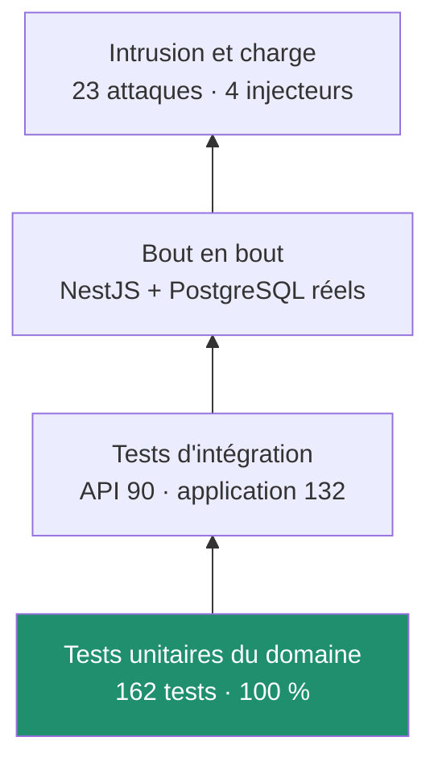

# Stratégie de test

## Ce qui est testé, et à quel niveau



| Niveau | Où | Combien | Couverture imposée |
| --- | --- | --- | --- |
| Domaine | `packages/core` | 162 | **100 %** lignes, branches, fonctions |
| API | `apps/api/src` | 90 | **100 %** lignes, branches, fonctions |
| Application | `apps/web/src` | 132 | 97 % lignes, 86 % branches, 90 % fonctions |
| Bout en bout | `apps/api/test` | 12 | — |
| Intrusion | `apps/api/test` | 23 | — |
| Charge | `packages/core`, `apps/api` | 8 + 4 | seuils de temps |

Les seuils sont vérifiés par la chaîne. Descendre en dessous fait échouer la
compilation, pas seulement un rapport.

---

## Pourquoi 100 % sur le domaine et pas sur l'interface

Le domaine porte les règles : une ligne non exécutée y est une règle non
vérifiée. Atteindre 100 % a d'ailleurs été utile en soi — cela a fait
**supprimer trois morceaux de code défensif inatteignables** et découvert deux
défauts réels :

- les jours fériés n'apparaissaient pas dans la vue semaine ;
- les champs de réglages n'avaient pas de libellé accessible.

Sur l'interface, exiger 100 % pousserait à écrire des tests de rendu
conditionnel sans valeur. Les seuils y sont donc élevés mais atteignables par
des tests qui décrivent des parcours réels.

Voir [ADR 0006](adr/0006-couverture-100.md).

---

## Comment les tests sont écrits

### Ils décrivent un comportement, pas une implémentation

```ts
it('l’avance de la semaine couvre la journée : il est 14h et on peut rentrer', () => {
```

Un nom de test se lit comme une phrase du cahier des charges. Si le nom parle
de `useState` ou de `mock`, le test est mal placé.

### Ils partent du scénario

```ts
const src = makeSource({
  now: atTimeOn(FRI, '14:00'),
  entries: [
    ...weekDays(MON).slice(0, 4).flatMap((d) => fullDay(d, '18:00')),
    entry(FRI, 'CLOCK_IN', '08:00'),
  ],
});
```

`packages/core/src/testing.ts` fabrique des situations lisibles : une journée
complète, une semaine, un pointage à une heure donnée.

### Le temps est maîtrisé

Aucun test ne dépend de l'heure réelle. Le domaine reçoit `now` en paramètre ;
l'application utilise `vi.setSystemTime`.

```ts
async function at(hhmm: string): Promise<void> {
  vi.setSystemTime(new Date(atTimeOn(MON, hhmm)));
  await act(async () => {
    await vi.advanceTimersByTimeAsync(16_000); // laisse battre le moteur
  });
}
```

### Les tests d'interface passent par l'utilisateur

```ts
await user.click(main().getByRole('button', { name: /Pointer mon arrivée/ }));
expect(await main().findByText(/Il te reste/)).toBeInTheDocument();
```

Requêtes par rôle et par libellé, jamais par classe CSS. Un test qui casse
lors d'un changement de style testait la mauvaise chose — et ces requêtes ont
au passage révélé les libellés manquants des champs de réglages.

---

## Développement piloté par les tests

Les modules à règles ont été écrits test d'abord : la fusion de
synchronisation, l'assainissement des données, les alertes.

Le cas le plus net est `apps/api/src/sync/merge.ts` — le test a été écrit,
exécuté (échec : module introuvable), puis l'implémentation. Le résultat s'en
ressent : l'arbitrage d'égalité en faveur du serveur est une décision qui
n'apparaît que si l'on écrit le cas avant le code.

Pour la sécurité, la même démarche : **écrire l'attaque, la voir réussir,
puis la faire échouer**.

---

## Les niveaux, un par un

### Domaine — `packages/core`

Aucune dépendance, donc aucun double. Les tests appellent des fonctions pures.

```bash
npm run test --workspace @workpulse/core
npm run test:cov --workspace @workpulse/core
```

### API — `apps/api/src`

Services instanciés à la main (`new SyncService(port)`), sans injection de
dépendances : un test unitaire n'a pas à démarrer NestJS. Le port de
persistance est un objet en mémoire.

```bash
npm run test --workspace @workpulse/api
```

### Application — `apps/web/src`

Vraie base locale (`fake-indexeddb`), vrai magasin, vrais composants. Les tests
d'écran rendent `<App />` en entier et cliquent dedans.

```bash
npm run test --workspace @workpulse/web
```

### Bout en bout — `apps/api/test/*.e2e.test.ts`

Vraie application NestJS, vraie base PostgreSQL. Ils ne re-testent pas les
règles de fusion : ils vérifient ce qu'eux seuls peuvent voir — le câblage, la
validation, l'authentification, le schéma.

Ils passent par `configureApp()`, la **même** configuration qu'en production.
Une protection qui n'existerait que dans le démarrage de production ne serait
vérifiée par personne.

```bash
DATABASE_URL=postgresql://... npm run test:e2e --workspace @workpulse/api
```

Sans `DATABASE_URL`, ils se déclarent ignorés plutôt que d'échouer.

### Intrusion — `apps/api/test/security.e2e.test.ts`

Voir [docs/securite.md](securite.md).

### Charge

Deux bancs distincts :

| Banc | Cible | Commande |
| --- | --- | --- |
| Moteur sur cinq ans d'historique | régression algorithmique | `npm run test:perf` |
| API sur un an de données | `N+1`, fuite de connexions | `npm run test:load` |

Les mesures de temps vivent dans des fichiers `*.perf.ts`, **hors de la suite
principale** : l'instrumentation de couverture fausse les durées et rendrait
les seuils instables.

Ce banc a payé : il a révélé qu'un départ oublié continuait de courir, et que
le report était recalculé à chaque battement d'horloge.

---

## Ce qui n'est pas testé, et pourquoi

| Non testé | Raison |
| --- | --- |
| `main.ts` | trois lignes de démarrage ; ce qu'il configure est testé via `bootstrap.ts` |
| Modules NestJS | déclaratifs ; une erreur y empêche le démarrage, donc les tests de bout en bout |
| `PrismaService` | deux appels au client Prisma |
| Icônes SVG | des chemins vectoriels |
| Compilation du `.apk` | seule la chaîne dispose du SDK Android ; l'assemblage est vérifié à chaque poussée |

Ces exclusions sont déclarées dans les fichiers de configuration, avec leur
raison. Une exclusion sans justification est une dette.

---

## Lancer

```bash
npm run test          # les trois paquets
npm run test:cov      # avec couverture et seuils
npm run test:perf     # tenue en charge du domaine
npm run verify        # ce que la chaîne vérifie, en local
```
